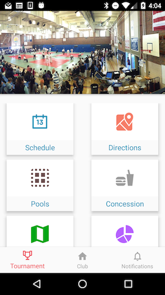
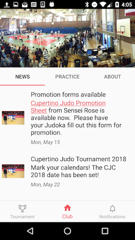
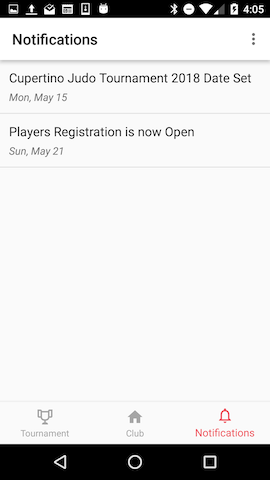

# Capstone-Project 

Final project for Udacity Android Developer Nanodegree course

## Cupertino Judo Android App 
Android app that provides club updates and tournament information and stats for the Annual Cupertino Judo Tournaments.
 
This Android application will provide general club information:
 * General club and contact information (map of club, practice hours)
 * Tournament information
  
For tournament information, we will provide app Notifications of up-to-date status of pooling information on the day of the tournament.  We will also provide the brackets of judokas fighting for current and previous tournaments.
   
This application gives users the peace of mind to know exactly when the polling of players start and when they complete on the day of the tournament.

For a detailed description of the app, please download the PDF documentat [here](https://github.com/fhirata/Capstone-Project/blob/master/Capstone_Stage1.pdf)

